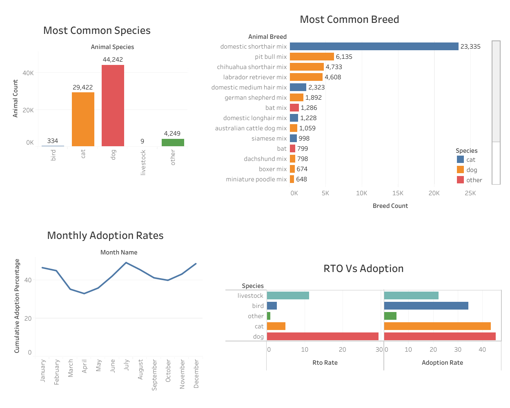
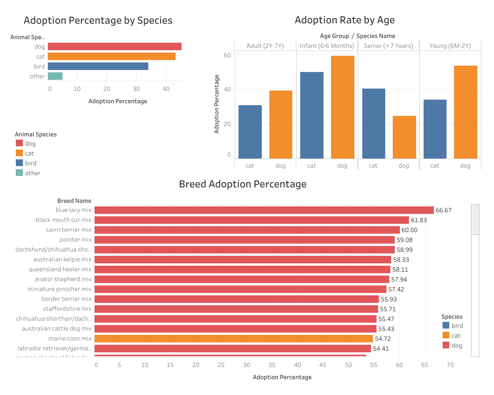

# sql-tableau-shelter-adoptions
Used **BigQuery SQL** for data cleaning and analysis to optimize shelter operations and improve animal adoption rates, visualized in **Tableau**.

## Visualization Images

Here are static previews of the three dashboards in this project. Click the live link above to interact with the full visualization.

### Dashboard 1: Shelter Intakes

### Dashboard 2: Adoption Success

### Dashboard 3: Interventions

##  Repository Contents

| File/Folder | Purpose |
| **[SQL Scripts for Analysis](shelter_optimization_queries.sql)** | Contains all BigQuery SQL code for data cleaning and metric calculation. |

| **[Final Project Report](Optimizing shelter operations and Improving adoption rates_2.pdf)** | A summary document detailing project findings and recommendations. |

| `Intakes.png`, `Adoptions.png`, `Intervention.png`  | Static previews of the final Tableau Dashboards. |

