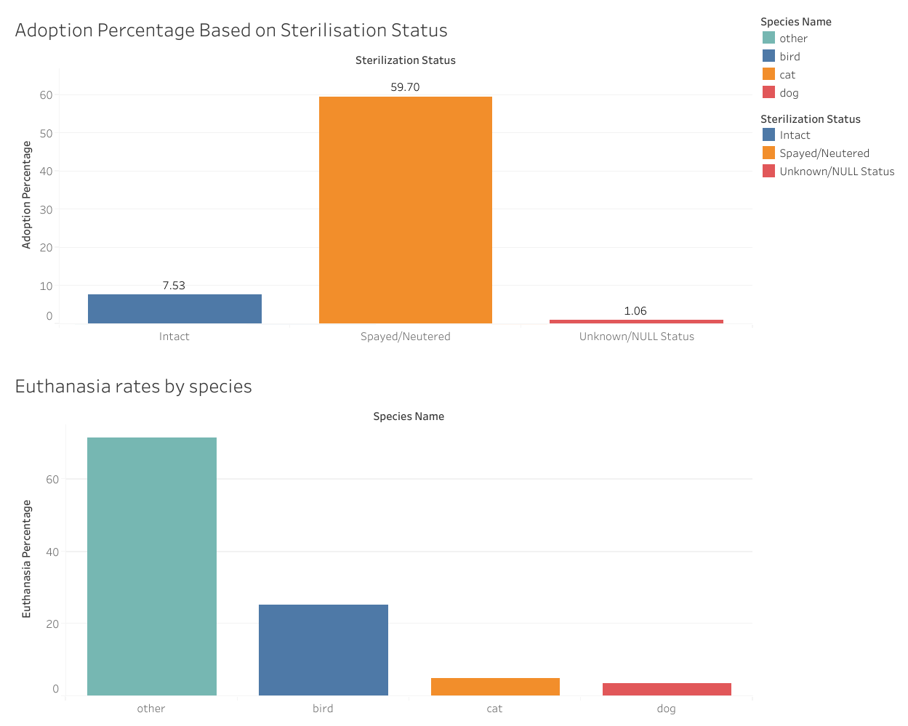

# Optimizing Shelter Operations and Improving Adoption Rates

## Project Overview

This project focuses on analyzing animal intake and outcome data from the Austin Animal Centre to identify key factors influencing an animal's final status (e.g., adoption, transfer, euthanasia). The goal is to provide data-driven insights and actionable recommendations to streamline shelter operations and increase adoption rates across different animal populations.

### Tools and Technologies

| Tool/Language | Function |
| :--- | :--- |
| **SQL** | Data cleaning and statistical analysis. |
| **Tableau** | Visualisation |
| **Kaggle/Public Data** | Primary data source and acquisition. |

###  Analysis Overview

The analysis utilized the Austin Animal Center Outcomes dataset, containing over **78,000 animal records** detailing species, breed, age, sterilization status, and final disposition over several years of operation.

***

## Key Analytical Findings

### 1. Shelter Intakes

* **Dogs (56%)** and **Cats (37%)** constitute over **94%** of the shelter's intake, confirming these groups require the majority of operational resources.
* The highest breed volume comes from the **Domestic Shorthair Mix** feline breed, followed by three common dog mixes (Pit Bull, Chihuahua, and Labrador Retriever Mixes).

### 2. Adoption Outcomes

* **Spayed/Neutered** animals have a dramatically higher **60% adoption rate**, compared to just **7.53%** for **Intact** animals..
* **Juvenile animals** (puppies/kittens) are adopted fastest, maximizing shelter flow. **Senior animals (7+ years)** present the highest placement challenge and lowest adoption rates.
* Dogs and Cats show high, competitive adoption rates (Dogs: 45.32%, Cats: 43.27%).

### 3. Operational & Program Effectiveness

* The **'Other'** category faces a high **71% euthanasia rate**, and **Birds** have a 25% death rate. These groups require immediate specialized wildlife transfer protocols.
* Success is balanced between **Adoption (45.32%)** and **Return to Owner (RTO) (29.37%)** in dogs while cats have a high **Adoption (43.27%)** rate but negligible **RTO (4.98%)**. 
* Peak adoption success is achieved in **July (49.2%)** and **December (48.6%)**; the annual low point occurs in **April (33%)**.

## Recommendation

1. Maximize surgical operations immediately to sterilize all animals, which is the best way to close the huge adoption gap between sterilised and intact pets.
 2. Establish a Wildlife/Exotic Transfer Protocol to move "Other" species to Wildlife sanctuaries and centers to minimize the 71.5% euthanasia rate. 
3. Develop specialized programs i.e fee waivers and focused marketing to improve adoption rates for low-success groups, especially Senior animals and Pit Bull Mixes.
 4. Launch mandatory, aggressive foster and marketing campaigns during the critical spring months (March–May) to counteract the 33% adoption slump identified in April
***

## Visualization Images

Here are static previews of the three dashboards in this project. Click the live link above to interact with the full visualization.

### Dashboard 1: Shelter Intakes

### Dashboard 2: Adoption Success

### Dashboard 3: Interventions

## 📁 Repository Structure
* `README.md` Project summary and findings
* `Shelter_optimization_queries.sql` Full SQL queries used for data cleaning and analysis
* `Optimizing shelter operations and Improving adoption rates_2` pdf document
* `Intakes`, `Adoptions`, `Intervention` Visualisations in Tableau

